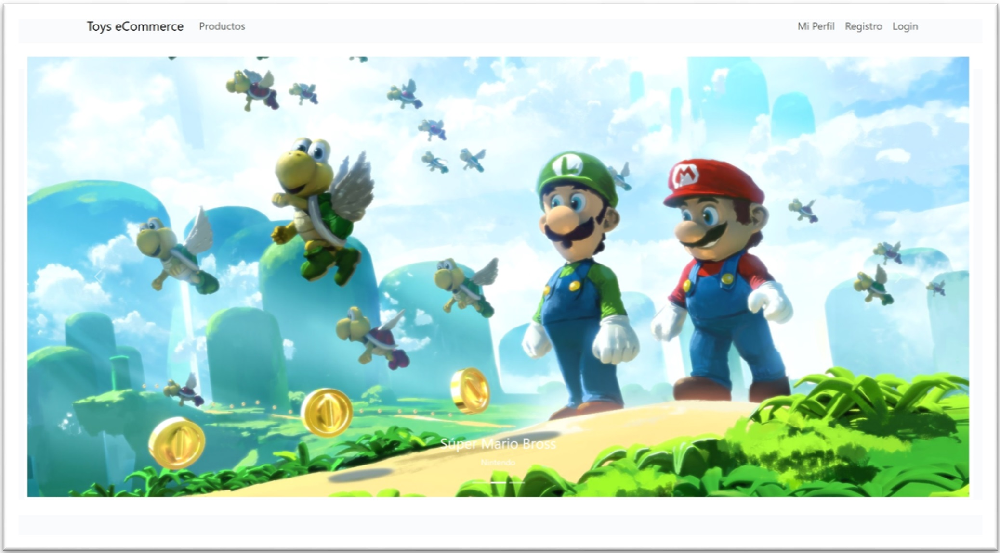
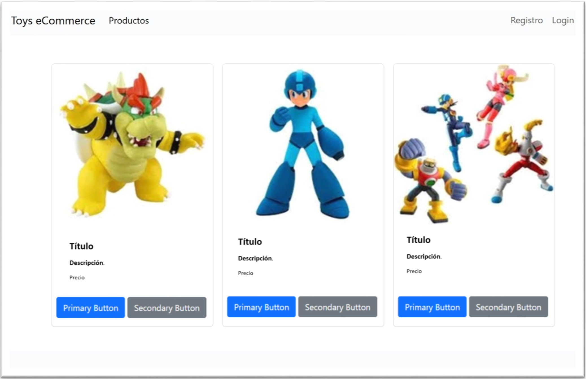
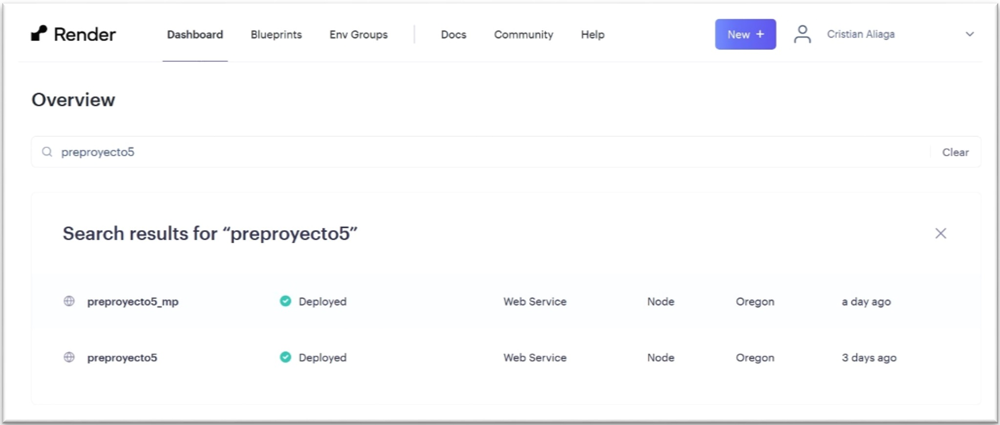
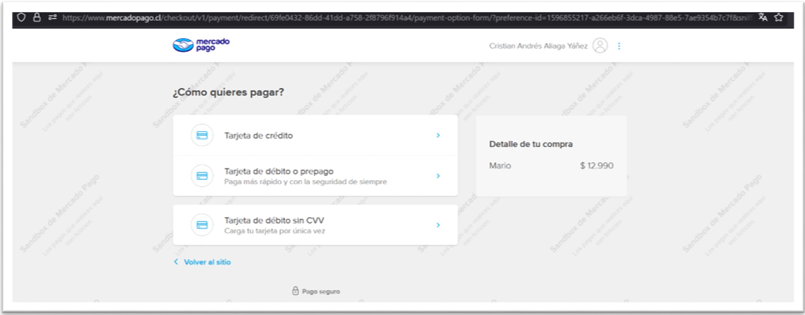
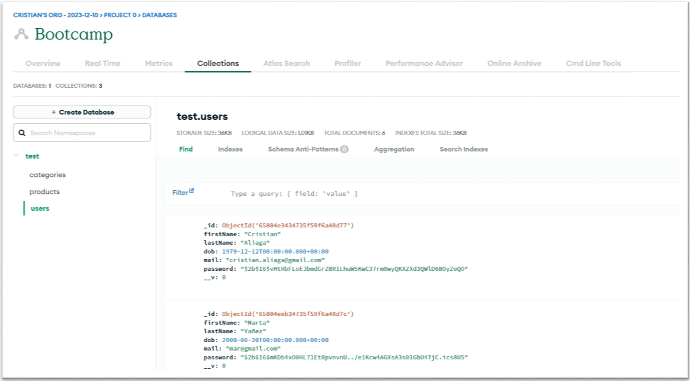

# PROYECTO 5: Aplicación de Comercio Electrónico.

## **ÍNDICE**

* [1. Introducción](#1-introduccion)
* [2. Prototipo](#2-prototipo)
* [3. Instalación](#3-instalación)
* [4. GitHub](#4-github)
* [5. Layout](#5-layout)
* [6. API](#6-api)
* [7. Base de Datos](#7-base-de-datos)

## 1. Intro

El proyecto consiste en la elaboración de un sitio Web de comercio electrónico, utilizando tecnologías como: Express, MongoDB, JWT para el Backend. React, Axios, Bootstrap y GitHub Pages para el Frond-End. Que permitan al usuario visualizar los productos, ver su detalle y realizar compras a través de Mercado Pago. Además de tener la opción de registrarse en el sitio.

## 2. Prototipo
**Home**

**Productos**

## 3. Instalación

### Frond-End Client:
- npm install
- npm install react-router-dom
- npm install react-bootstrap bootstrap
- npm install gh-pages
- npm install nodemon
- npm run dev
- npm install axios
- npm install mercadopago

### Back-End Server:
- npm init -y
- npm install express
- npm install dotenv
- npm install nodemon
- npm install cors
- npm install bcrypt
- npm install express-jwt
- npm install jsonwebtoken
- npm install moongose
- npm install mongodb

## 4. GitHub

**Web Restaurante** <https://cristian-aliaga.github.io/preproyecto5_v1/>

**Proyecto GitHub** <https://github.com/cristian-aliaga/preproyecto5_v1>

## 5. Layout 

1. Home: Página principal.
2. Productos: Acceso a los productos de la tienda, con la opción de ver detalles y comprar.
3. Mi Perfil: Información del perfil del usuario.
4. Registro: Permite realizar el registro mediante correo electronico y contraseña.
5. Login: Permite realizar el login para acceder a páginas que requieren autenticación.

>Nota:
>>Mi perfil y compras presentan problemas, los que están en corrección.

## 6. API
Se utilizó API render para la implementación de dos API, una para las consultas a la base de datos MongoDB Atlás, para el menú, usuarios y Blog. Mientras que la segunda API es para las transacciones de Mercado Pago.

**API Render**

**Prueba de Transacción Mercado Pago**

## 7. Base de Datos
La aplicación almacenará los datos del Menú, reservas y Blog, en una Base de Datos NoSQL en Firebase. La base de dotos "Bootcamp" tiene tres colecciones; 
- Categorias.
- Productos.
- Usuarios.
